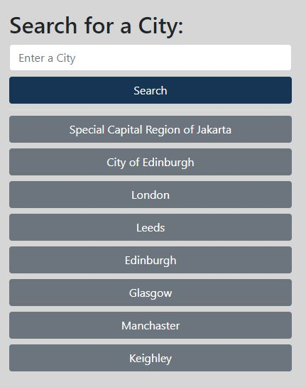
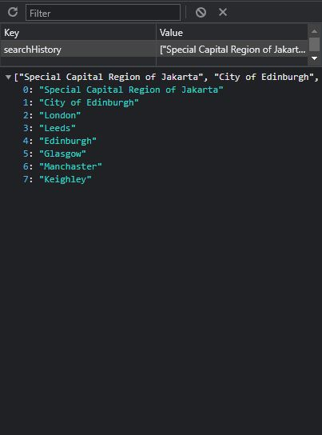

# Module 8 Challenge: Weather Dashboard

  

 

## Table of Contents
* [Description](#description)
* [Features](#features)
* [Installation & Deployment](#installation-and-deployment)
* [How to Use](#how-to-use)
* [License](#license)

 

 

## Description

This challenge presents a real-world situation in which the newfound JavaScript skills will come in handy. The code has been built to help travelers to see the weather outlook for multiple cities so they can plan a trip accordingly. Users can check weathers for current and the next five days based on the city that users wish to see.

 

 

## Features

This application works by clicking or searching any cities you wish to check the weather. Any cities that has been searched will be shown in the search history. Once a city been chosen, a data of current weather and the forecast for the next five days in that city will be shown.

 

### Current Weather

 When a user views the current weather conditions for that city they are presented with:
  * The city name
  * The date
  * An icon representation of weather conditions
  * The temperature
  * The humidity
  * The wind speed

 

### 5-day Forecast

When a user view future weather conditions for that city they are presented with a 5-day forecast that displays:
  * The date
  * An icon representation of weather conditions
  * The temperature
  * The humidity

 

### Search History

* When a user searches for a city they are presented with current and future conditions for that city and that city is added to the search history
* When a user click on a city in the search history they are again presented with current and future conditions for that city

 

 

## Installation and Deployment

Installation not required, since this is a "plug and play" type of application. The user can simply run it locally by clicking on the `index.html` file and opening in either their default or preferred browser.

Application can also be accessed at following links:
* [GitHub repository](https://github.com/YueHuaHua/module-08-challenge).
* [Deployed application](https://yuehuahua.github.io/module-08-challenge/).

 

 

## How to Use 

* Click or search a city's name (e.g., `London`)
* See current weather on the right top panel
* See the next five day forecast below the current weather

 

 

## License

Licensed under the [MIT license](https://github.com/git/git-scm.com/blob/main/MIT-LICENSE.txt). See LICENSE for the full details.
